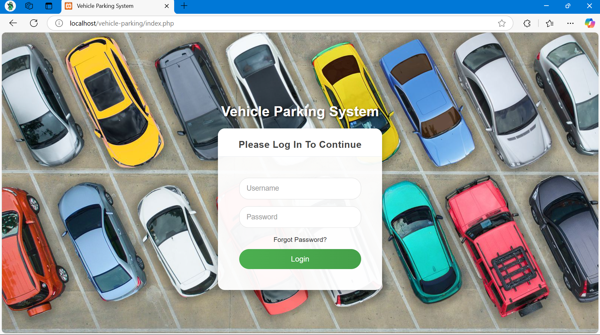
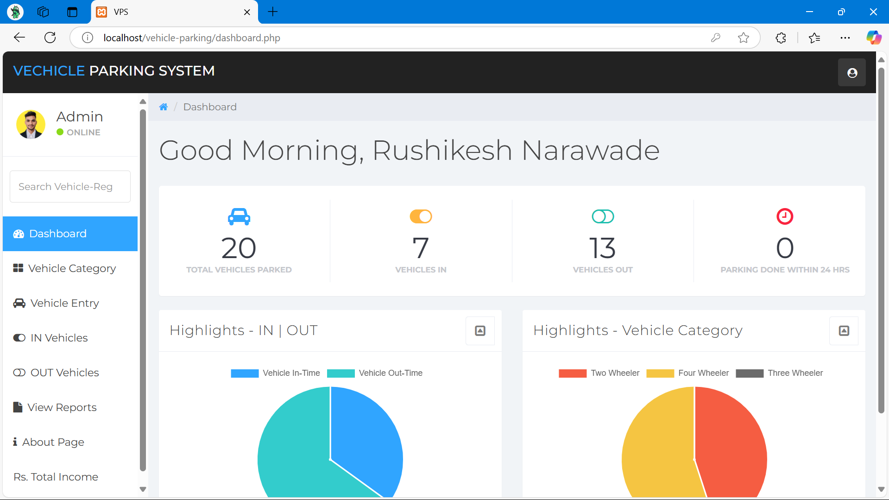
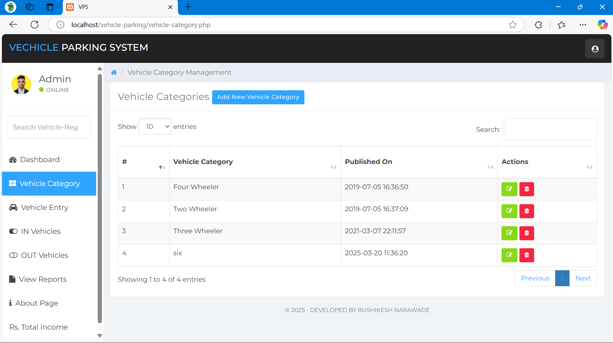
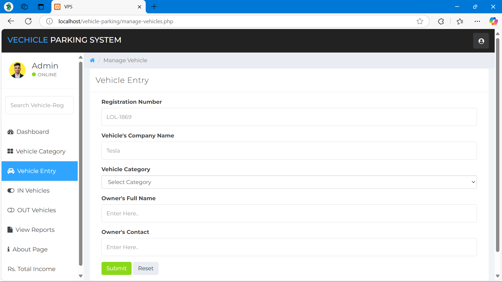
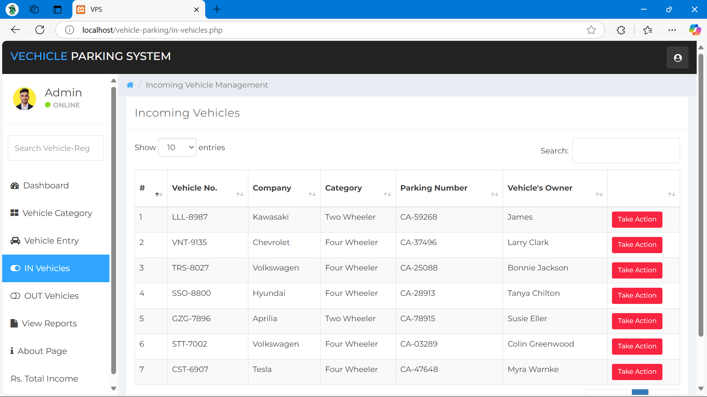
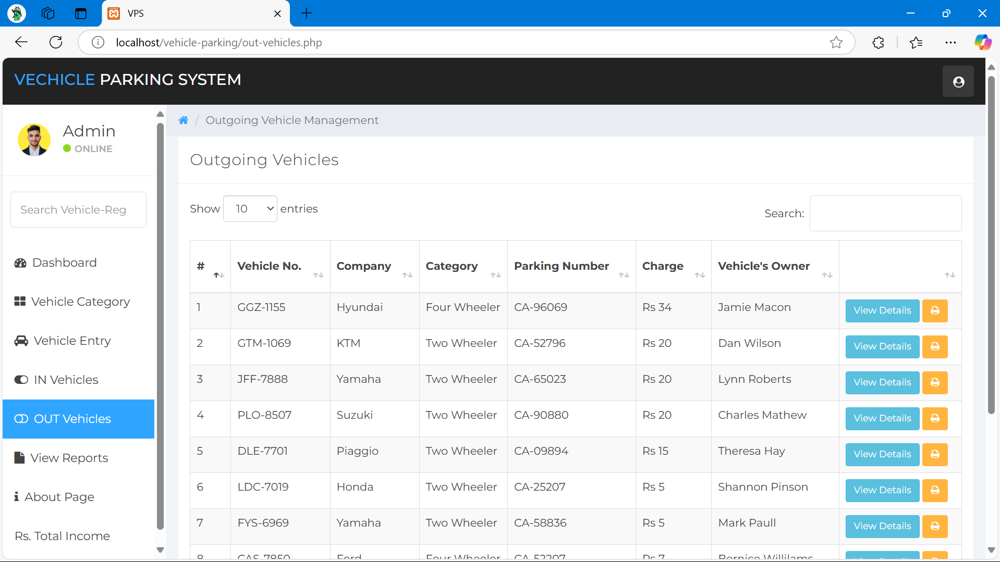
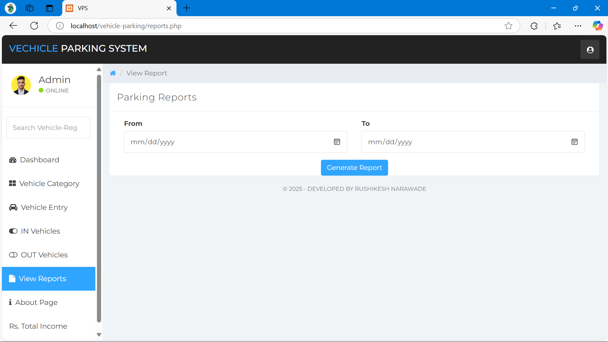
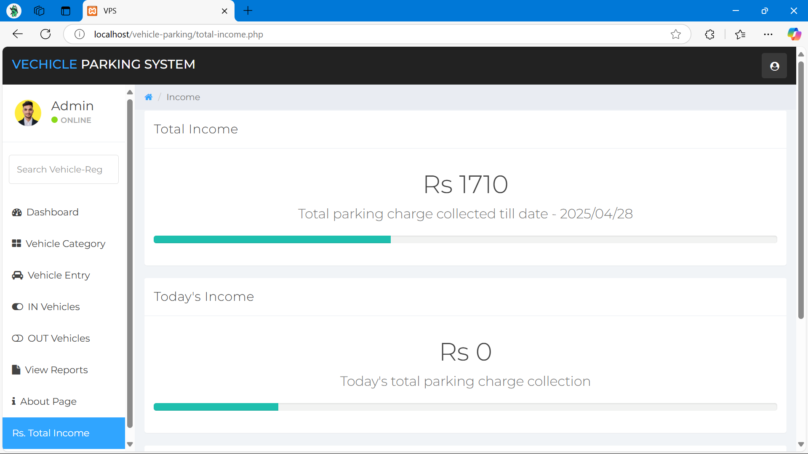

# 🚗 Safety Zone Vehicle Parking System

A smart web-based parking reservation platform designed to reduce traffic congestion and improve the parking experience in urban areas like Pune. This system enables users to reserve parking spots in advance and view real-time parking availability, ensuring smooth and efficient vehicle flow.

---

## 📌 Introduction

The **Safety Zone Vehicle Parking System** was developed in response to the challenges of traffic congestion, lack of organized parking, and frequent vehicle collisions in busy urban centers.

### 🧠 Objectives

- Minimize parking search time
- Reduce traffic congestion
- Improve safety in parking zones
- Provide real-time parking updates
- Simplify parking reservations for users

---

## 🔧 Technologies Used

- **HTML** – for building user-friendly and interactive interfaces.
- **CSS** – for styling and responsive layout with basic input validation.
- **PHP** – for server-side scripting and handling business logic.
- **XAMPP (Apache + MySQL)** – for local server and database management.
- **jQuery** - for styling and minimizing code.
- **Bootstrap** - for efficient code written.

---

## 📊 System Design

The system was designed using:

- **Data Flow Diagrams (DFDs)** – to visualize how data moves through the system.
- **Entity-Relationship Diagrams (ERDs)** – to map out database structure and relationships.

---

## 📷 Project Screenshots

Below are the images demonstrating the flow and functionality of the system:

| Step | Screenshot |
|------|------------|
| 1️⃣ Login Page |    |
| 2️⃣ Home Page |  |
| 3️⃣ Car Category |   |
| 4️⃣ Vehicle Entry |  |
| 5️⃣ In Vehicles |  |
| 6️⃣ OUt Vehicles |  |
| 7️⃣ Reports View |  |
| 8️⃣ Total Income ||

---

## 🏁 How to Run the Project Locally

1. **Download XAMPP** and install it on your system.
2. Clone or download this project into the `htdocs` directory inside the XAMPP folder.
3. Start **Apache** and **MySQL** from the XAMPP control panel.
4. Open `phpMyAdmin` and import the provided database file (if available).
5. Navigate to `http://localhost/SafetyZoneParking` in your browser.

---

## 🚀 Features

- User and Admin login functionality
- Real-time parking slot availability
- Easy slot booking and cancellation
- Admin dashboard for managing bookings and users
- Reports and logs for monitoring usage

---

## 📚 Conclusion

The **Safety Zone Vehicle Parking System** is a modern, scalable, and practical solution to urban parking challenges. By integrating intuitive UI/UX design with strong backend support, this system enhances safety, convenience, and efficiency in managing parking spaces.

---

## 👤 Developed By

Rushikesh Narawade  
📍 Pune, Maharashtra  
📧 [narawaderushikesh@gmail.com]  
🌐 [https://rushikesh31apk.bio.link/]

